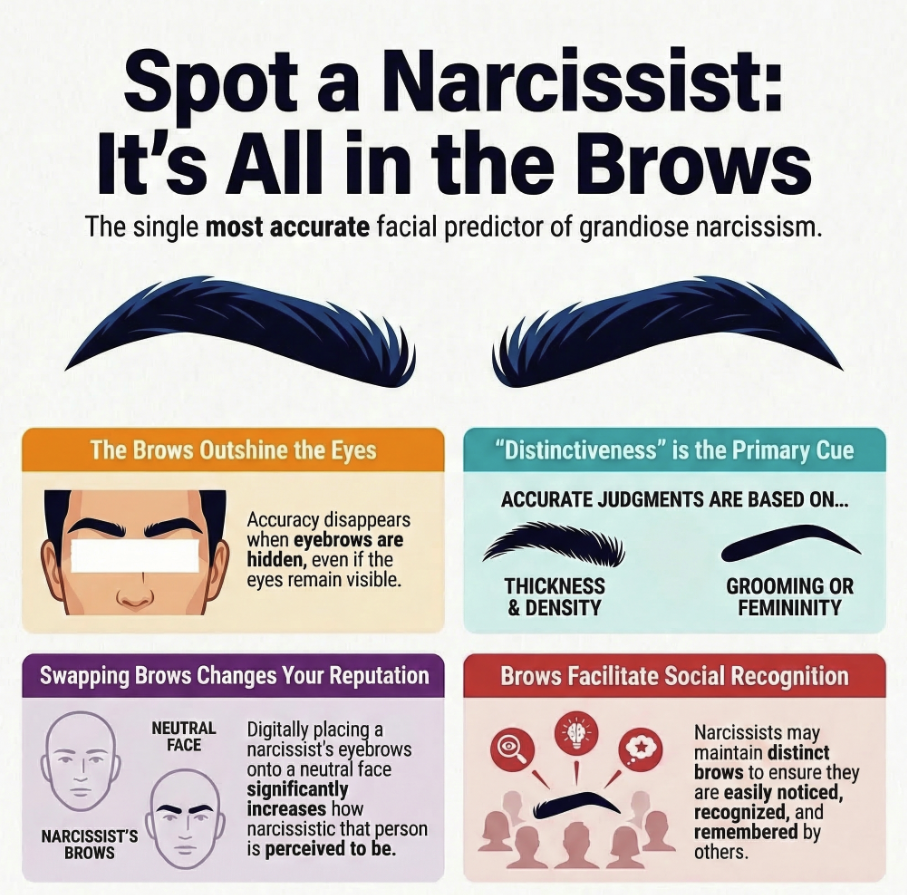

::: {.tldr}
- People can detect narcissism from a face alone, even from a single eyebrow
- It is eyebrow distinctiveness — thickness, density, and darkness — that carries the signal
- Swapping narcissists' eyebrows onto neutral faces made those faces look more narcissistic, confirming the cue is real
:::

Most of us like to think we can spot a narcissist. The self-promotion, the name-dropping, the way they steer every conversation back to themselves. But what if you could identify someone's narcissistic tendencies before they had said a single word — just from looking at their face?

A series of studies by Giacomin and Rule [-@giacomin2019] at the University of Toronto suggests that you probably can, and that the feature doing the most work is one you might not expect: the eyebrows.

## Why spotting narcissism matters

::: {.callout-note}
## What is grandiose narcissism?
**Grandiose narcissism** is the tendency to be self-focused, egotistical, and vain. People high in this trait often appear charming and confident at first, but tend to prioritise attention and admiration over genuine closeness. This can lead to exploitation and conflict in relationships, workplaces, and other social settings.
:::

Identifying narcissistic tendencies early has real practical value. Narcissists can be initially appealing — they tend to dress well, project confidence, and make strong first impressions [@vazire2008]. It is only later that the more damaging patterns of behaviour tend to emerge. If our brains are already picking up on subtle facial cues, understanding what those cues are could help explain how social perception actually works.

Previous research had established that people *can* judge others' grandiose narcissism from neutral photographs with above-chance accuracy [@holtzman2011]. What no one had established was *which* features supported those judgements. That is the question Giacomin and Rule set out to answer with their ingenious series of experiments.

## What the researchers did

The research team photographed 39 undergraduate students posing with neutral expressions under standardised laboratory conditions. Each participant also completed the Narcissistic Personality Inventory (NPI), which measures narcissistic tendencies across several dimensions including grandiose exhibitionism and entitlement.

In Study 1, hundreds of online participants were asked to rate how narcissistic each target appeared. Crucially, each rater saw only one version of each face — the full face, an inverted face, just the upper half, just the lower half, the eye and eyebrow region together, the face with eyes obscured, the face with eyebrows obscured, eyes alone, or eyebrows alone.

By comparing how accurately raters judged narcissism across these conditions, the researchers could identify which part of the face was doing the work.

::: {.panel-tabset}

## Method

In Study 1, 39 students were photographed and rated for narcissism by online participants who each saw just one cropped version of each face. The face was progressively isolated — from full face to upper half, eye region, eyes alone, and eyebrows alone — to locate the key cue. Studies 2A and 2B replicated this with a larger sample of 121 students and over 700 raters. Study 2C had trained coders measure eyebrow characteristics (grooming, distinctiveness, femininity). Studies 3A and 3B experimentally swapped eyebrows between high- and low-narcissism faces to test the causal role of the brows.

## Findings

Participants could accurately judge narcissism from the full face, the inverted face, the upper half of the face, and the combined eye-and-brow region. They could *not* do so when the eyebrows were covered, nor from the eyes alone. Covering the eyes (but leaving brows visible) still produced accurate judgements. This pattern pointed clearly to the eyebrows as the key feature. Studies 2A–2C confirmed that eyebrow *distinctiveness* — how thick, dense, and dark the brows appeared — was the valid cue linking narcissists' eyebrows to others' perceptions of narcissism. In Study 3, faces given narcissists' eyebrows were rated as more narcissistic; faces given non-narcissists' eyebrows were rated as less narcissistic.

## Implications

The findings suggest that narcissism leaves a detectable physical signature in the face — specifically in the brows — that perceivers can read without being told what to look for. Because narcissists tend to score higher on grandiose exhibitionism (the desire to be noticed and admired), the authors suggest that distinctive brow maintenance may be one way in which narcissists manage their appearance to attract attention.

:::

## A surprisingly powerful signal

::: {.pullquote}
"Participants accurately detected narcissism from the eye region but not when the eyebrows were occluded — suggesting the eyebrows are the definitive cue."
:::

The most striking result came from Studies 3A and 3B, where the researchers did something that is only possible in a laboratory: they digitally transplanted eyebrows between faces. Faces belonging to moderate-narcissism targets looked significantly more narcissistic when given a high-narcissist's eyebrows, and significantly less narcissistic when given a low-narcissist's eyebrows. Reversing this — giving non-narcissists' brows to the narcissistic targets — also reduced how narcissistic those faces appeared.

This is not just a correlational finding. Manipulating the eyebrows directly changed how narcissistic a face looked, which is strong evidence that the brows are genuinely communicating something about personality — not just correlating with it.

## What makes a "narcissistic" eyebrow?

The eyebrows of those high in grandiose narcissism were rated as more *distinctive*: thicker, denser, and darker. Crucially, it was distinctiveness that mediated accurate judgements, not grooming or femininity. This matters because distinctiveness could stem from either natural brow morphology (the way a person's brows naturally grow) or from deliberate grooming choices. Narcissists may seek out and maintain more prominent brows to facilitate the recognition and admiration they strongly desire.

Interestingly, the signal was stronger for female targets than male targets — a finding the authors attributed to the smaller number of men in the sample rather than a genuine gender difference, and one worth examining in future research.

::: {.callout-warning}
## Limitations to keep in mind
Effect sizes across studies were modest, reflecting the narrow range of facial real estate on which these judgements rest. The target samples were predominantly female and drawn from a single Canadian university, which limits how far the findings can be generalised. Ratings were made by online participants in a low-stakes setting, which may not replicate how people form impressions in real-world encounters. The study also relied on self-reported narcissism rather than clinician assessments.
:::

## What this tells us about how we read faces

Research like this fits within a broader picture of how much information people extract from faces automatically and rapidly. The face is not just a means of expression; it is a persistent signal, readable even from a still photograph, even from a single feature. We have likely evolved to be sensitive to such cues because they help us navigate social life — deciding whom to trust, approach, or avoid.

What is especially notable here is how specific the relevant cue turned out to be. Not the eyes, not the lower face, not the face as a whole gestalt — the eyebrows. And not just their shape, but their distinctiveness. This kind of precision is rare in person-perception research and suggests that the mechanism behind narcissism detection is not a vague "something about the face" but a fairly targeted feature-detection process.

Whether people are consciously aware of reading eyebrows this way is another question entirely — one that future research will need to address.

## References

::: {#refs}
:::

---

::: {.author-card}

Example Student

  Psychology student at Goldsmiths, University of London.
  Interested in individual differences and social perception - and trying not to look at your eyebrows.

:::

*This post is published under [CC BY 4.0](https://creativecommons.org/licenses/by/4.0/).*
