## {background-color="#9B1B30"}

::: {.r-fit-text style="color: white;"}
Nobody ever got hired<br>for being unable to explain<br>what they know.
:::

::: {.notes}
Open bold. Let this land. This is the whole argument in one sentence.
:::

---

## Let's get something out of the way {.center}

::: {.incremental}
- This is not about becoming a blogger.
- This is not about writing about psychology forever.
- This is about the **single most transferable skill** you will develop at university:
:::

. . .

::: {style="font-size: 1.3em; text-align: center; margin-top: 0.5em; color: #9B1B30; font-weight: 700;"}
The ability to take something complex and make it land.
:::

---

## What "Science Communication" actually means {.smaller}

It is not one skill. It is a stack.

| Layer | What it is | Where it shows up |
|-------|-----------|-------------------|
| **Comprehension** | Understanding deeply enough to simplify | Every job, meeting, pitch |
| **Audience awareness** | Knowing what your reader does not know | Marketing, UX, consulting, therapy |
| **Narrative structure** | A story with beginning, middle, end | Proposals, fundraising, journalism |
| **Visual thinking** | The right image, chart, or diagram | Design, data science, publishing |
| **Editing** | Cutting what does not earn its place | Management, strategy, leadership |

---

## The Skillful Psychology Student {.center}

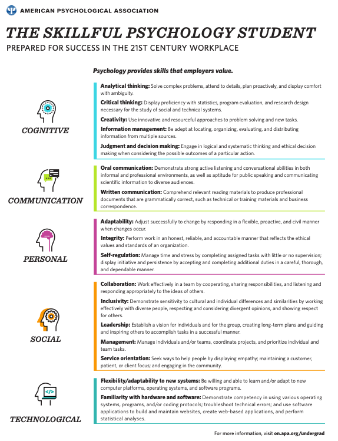{fig-alt="APA Skillful Psychology Student infographic" fig-align="center" width="55%"}

---

## The APA agrees {.smaller}

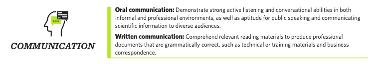{fig-alt="APA communication skills" fig-align="center" width="80%"}

Communication is not a soft add-on. It is a **core competency** of the psychology degree. The APA Guidelines for the Undergraduate Psychology Major list it as one of the five pillars of the discipline.

---

## {background-color="#1a1a1a"}

::: {.r-fit-text style="color: white;"}
"If you can't explain it simply,<br>you don't understand it well enough."
:::

::: {style="color: #ccc; text-align: center; font-size: 0.9em; margin-top: 1em;"}
Often attributed to Einstein. Probably apocryphal. Still true.
:::

---

## The Greats {background-color="#9B1B30"}

::: {.r-fit-text style="color: white;"}
People who changed<br>the world by explaining it.
:::

---

## Feynman: "I'm an ordinary person who studied hard" {.smaller}

:::: {.columns}
::: {.column width="55%"}
**Richard Feynman** (1918--1988)

Nobel laureate in physics. But his legacy is not the diagrams.

It is that he could explain *anything* to *anyone*.

His Cornell lectures made quantum electrodynamics feel conversational. He testified to Congress about the Challenger disaster using a glass of ice water and a rubber O-ring.

**The Feynman lesson:** Complexity is not a sign of intelligence. Clarity is.
:::
::: {.column width="45%"}


::: {style="font-size: 0.7em; color: #666; text-align: center;"}
"I'm an ordinary person who studied hard."
:::
:::
::::

---

## Sagan: Pale Blue Dot {.smaller}

:::: {.columns}
::: {.column width="55%"}
**Carl Sagan** (1934--1996)

Astronomer. Author. The voice of *Cosmos*.

Sagan did not simplify science. He made you feel the *scale* of it. "Billions and billions" became a cultural phrase not because it was dumbed down, but because it was felt.

He understood that science communication is not about lowering the bar. It is about **widening the door**.

**The Sagan lesson:** Awe is a communication strategy. If you feel it, your audience will too.
:::
::: {.column width="45%"}


::: {style="font-size: 0.7em; color: #666; text-align: center;"}
"Look again at that dot. That's here. That's home. That's us."
:::
:::
::::

---

## Attenborough: master of disappearing {.smaller}

:::: {.columns}
::: {.column width="55%"}
**Sir David Attenborough** (b. 1926)

Seven decades of broadcasting. Still going.

What Attenborough does better than anyone: he **disappears**. The story is never about him. It is about the animal, the ecosystem, the moment.

He also proves that science communication is not just for scientists. Attenborough studied geology and zoology, then spent his career translating the work of others.

**The Attenborough lesson:** The best communicator is the one you forget is there. The subject is the star.
:::
::: {.column width="45%"}


::: {style="font-size: 0.7em; color: #666; text-align: center;"}
A little monkey trying to make his way in the world.
:::
:::
::::

---

## Goodall: "What you do makes a difference" {.smaller}

:::: {.columns}
::: {.column width="55%"}
**Jane Goodall** (1934--2025)

Primatologist, conservationist, and one of the most recognisable scientists of our time.

Goodall's genius was not just the fieldwork — it was making people *care*. She gave the chimps names. She broke the rules of detached scientific reporting and built a global movement.

Her late career was entirely science communication: talks, books, the Jane Goodall Institute. The research became the platform. The communication became the mission.

**The Goodall lesson:** Science communication is not what you do after the research. Sometimes it *is* the point.
:::
::: {.column width="45%"}


::: {style="font-size: 0.7em; color: #666; text-align: center;"}
"You have to decide what kind of difference you want to make."
:::
:::
::::

---

## Loftus: rewriting your memories with an advert {.smaller}

:::: {.columns}
::: {.column width="55%"}
**Elizabeth Loftus** (b. 1944)

The world's leading expert on false memory. But also one of psychology's most effective public communicators.

Loftus does not just publish papers. She testifies in court, she appears on television, she gives talks that make juries — and the public — understand that memory is not a recording.

Her work on the misinformation effect has influenced law, policy, and culture. None of that happens if she cannot explain it outside the lab.

**The Loftus lesson:** Impact requires communication. The best research in the world changes nothing if nobody outside your field understands it.
:::
::: {.column width="45%"}


::: {style="font-size: 0.7em; color: #666; text-align: center;"}
The Bugs Bunny study — a masterclass in communicating a finding.
:::
:::
::::

---

## The Bugs Bunny experiment {.smaller}

Braun, Ellis & Loftus (2002) showed that a single **fake Disney advert** featuring Bugs Bunny could make people "remember" meeting him at Disneyland as a child.

This is impossible. Bugs Bunny is a Warner Bros. character. He has never been at Disneyland.

But after viewing the ad, **16% of participants reported remembering shaking hands with Bugs Bunny at a Disney resort.**

The ad did not just change attitudes. It **rewrote memories**.

::: {.callout-note}
## Why this is great science communication
Loftus did not need to explain signal detection theory or source monitoring frameworks. She told a story about a cartoon rabbit and a handshake. Everyone gets it. The finding communicates itself because the example is perfectly chosen.

*This study was the first time I ever encountered real psychological data — as a marketing professional, not a psychologist. It changed the direction of my career.*
:::

---

## {background-color="#9B1B30"}

::: {.r-fit-text style="color: white;"}
But those are legends.<br>What about *us*?
:::

---

## The Modern Communicators

Science communication did not stay in lecture halls. It went everywhere.

---

## In writing: Ed Yong {.smaller}

:::: {.columns}
::: {.column width="55%"}
**Ed Yong** — staff writer at *The Atlantic*

Won the Pulitzer Prize for Explanatory Reporting in 2021 for his COVID-19 coverage. His book *I Contain Multitudes* made the microbiome genuinely fascinating to a mass audience.

Yong does not have a science PhD. He has a zoology degree and an extraordinary ability to read 40 papers and turn them into one clear story.

**The lesson:** You do not need to be the expert. You need to be the translator.
:::
::: {.column width="45%"}
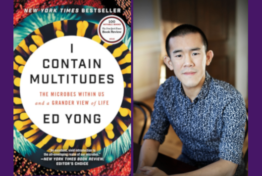{fig-alt="Ed Yong" width="100%"}

::: {style="font-size: 0.7em; color: #666; text-align: center;"}
*"The best science writing makes the reader feel smarter, not smaller."*
:::
:::
::::

---

## On screen: Hannah Fry {.smaller}

:::: {.columns}
::: {.column width="55%"}
**Hannah Fry** — mathematician, UCL professor, BBC presenter

Fry presents documentaries on algorithms, AI, and mathematics to mainstream BBC audiences. Her TED talks have been viewed millions of times. Her book *Hello World* made algorithmic decision-making accessible without losing its ethical weight.

She is a working academic who also happens to be one of the most effective communicators in Britain.

**The lesson:** Academic rigour and public accessibility are not opposites. They are the same skill applied differently.
:::
::: {.column width="45%"}
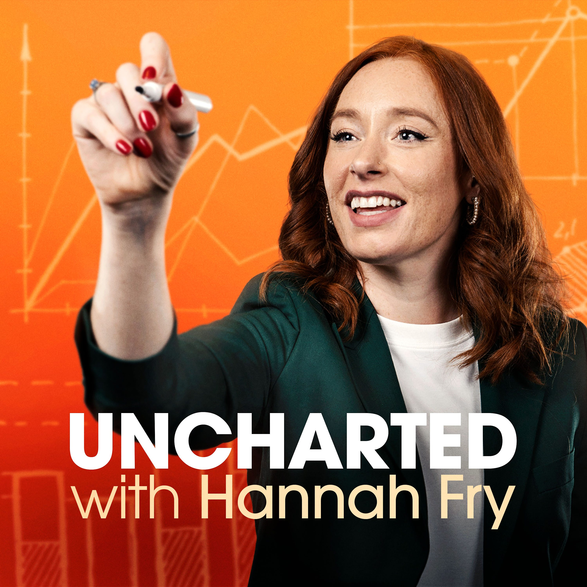{fig-alt="Hannah Fry" width="100%"}

::: {style="font-size: 0.7em; color: #666; text-align: center;"}
*"If you can make someone care about a maths problem, you can make them care about anything."*
:::
:::
::::

---

## In data: Hans Rosling {.smaller}

:::: {.columns}
::: {.column width="55%"}
**Hans Rosling** (1948--2017) — physician, statistician, sword-swallower

His Gapminder presentations turned global health data into theatre. Bubbles moved. Axes told stories. Audiences gasped at data about child mortality.

Rosling proved that a chart is not a chart. It is a **narrative device**. The same data, presented differently, changes minds or puts them to sleep.

**The lesson:** Data does not speak for itself. You speak for it. Learn to speak well.
:::
::: {.column width="45%"}


::: {style="font-size: 0.7em; color: #666; text-align: center;"}
200 countries, 200 years, 4 minutes. Data as theatre.
:::
:::
::::

---

## And also: the power of gesture {.smaller}

Communication is not just words. It is **body language, gesture, and performance**.

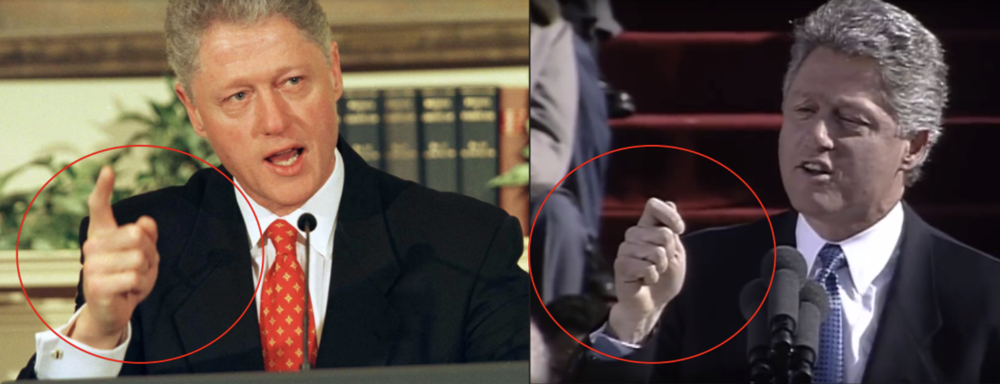{fig-alt="Clinton gesture comparison" fig-align="center" width="80%"}

Bill Clinton's communication coaches replaced his natural pointing gesture with the now-famous thumb-over-fist. Pointing is aggressive. The thumb is assertive but warm. That single change in nonverbal communication reshaped how millions of people perceived him.

**Every detail of communication is a choice.**

---

## {background-color="#1a1a1a"}

::: {.r-fit-text style="color: white;"}
OK but what about<br>closer to home?
:::

---

## Your lecturer does this too {.smaller}

Science communication is not something I teach from a distance. It is something I do.

:::: {.columns}
::: {.column width="33%"}
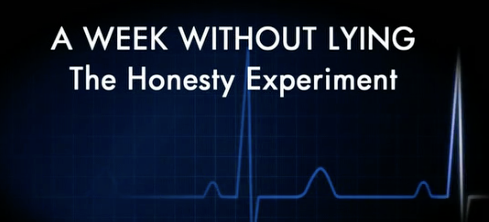{fig-alt="Horizon honesty experiment" width="100%"}

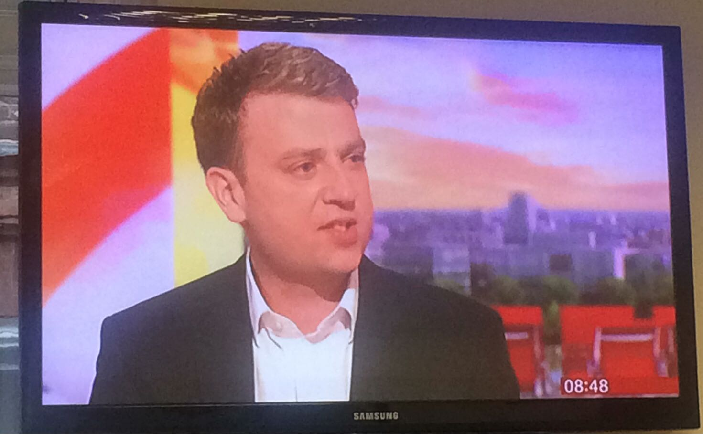{fig-alt="BBC Breakfast" width="100%"}
:::
::: {.column width="33%"}
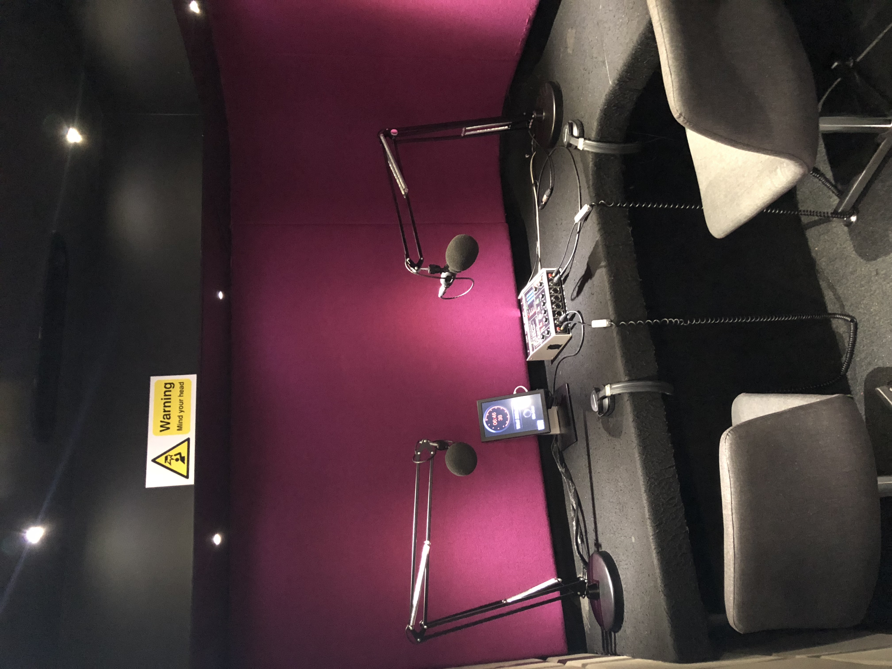{fig-alt="BBC Radio tour" width="100%"}

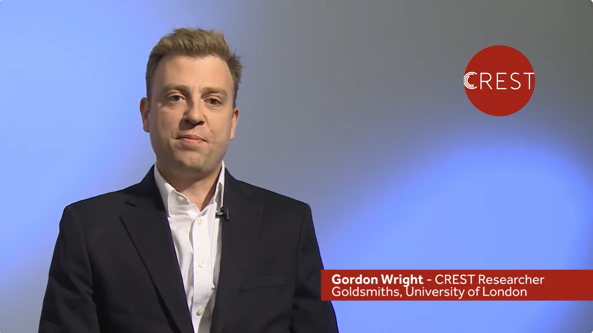{fig-alt="CREST Gordon" width="100%"}
:::
::: {.column width="33%"}
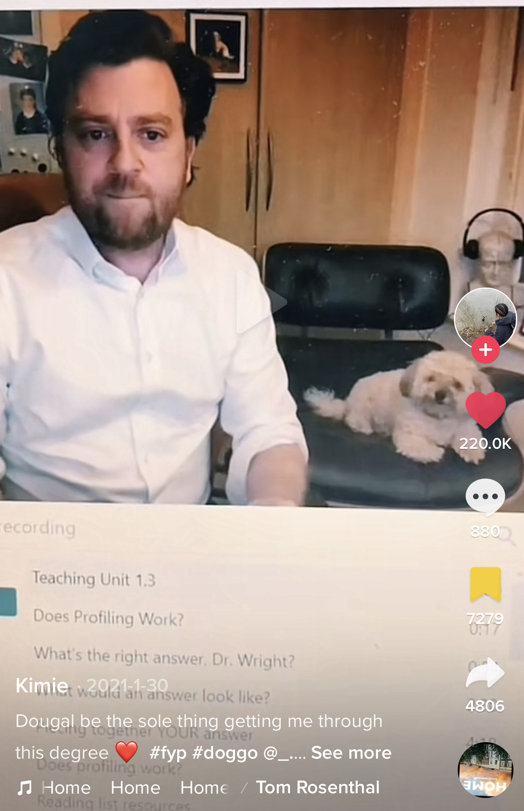{fig-alt="TikTok famous" width="100%"}

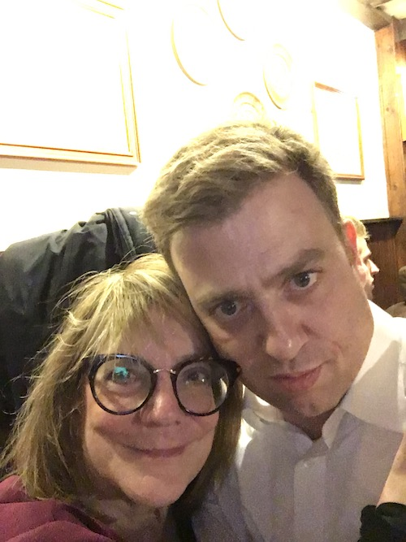{fig-alt="Gordon and Beth Loftus" width="100%"}
:::
::::

---

## Different platforms, same skill {.smaller}

:::: {.columns}
::: {.column width="50%"}

**BBC Horizon** — 60-minute documentary. Millions of viewers. I was running an experiment on the psychology of deception, on camera, for a general audience.

**BBC Breakfast / Radio** — Live national broadcasting. No second takes. You either communicate clearly or you do not.

**TikTok** — 60 seconds. A dog. 1 million views. The platform is absurd. The communication skill is identical.

Each of these required the same core competencies you are building in this module.
:::
::: {.column width="50%"}

**Academic conferences** — presenting to experts who will challenge every claim.

**Courtrooms** — as an expert witness, explaining psychological concepts to juries.

**CREST** — the Centre for Research and Evidence on Security Threats. Translating security research for government and practitioners.

The medium changes. The skill does not.
:::
::::

---

## Science communication as immersive theatre {.smaller}

At Goldsmiths, the Forensic Psychology Unit turned science communication into something nobody expected: **student-led immersive crime events**.

:::: {.columns}
::: {.column width="33%"}
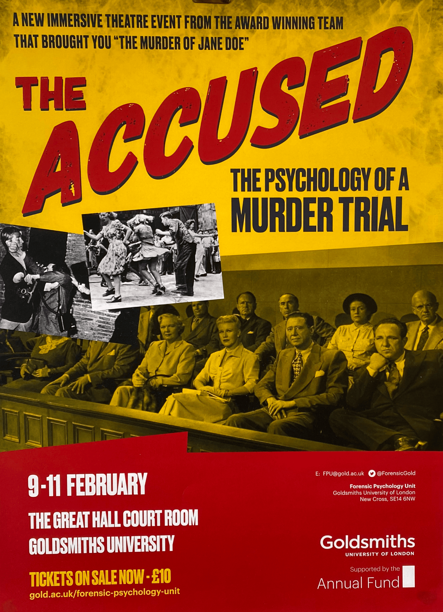{fig-alt="The Accused poster" width="100%"}
:::
::: {.column width="33%"}
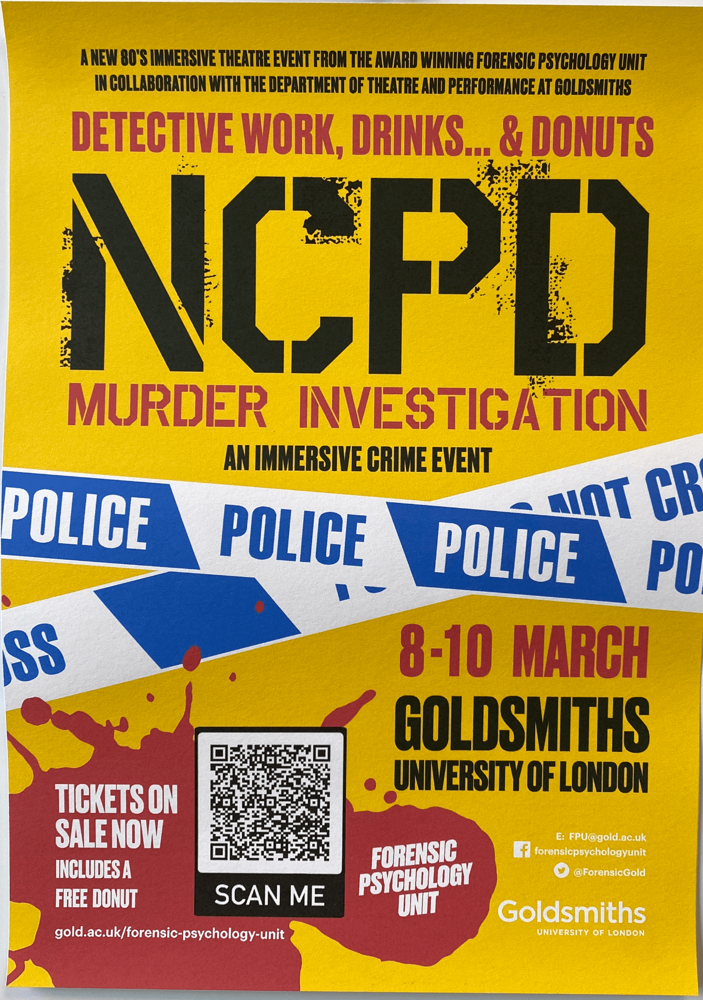{fig-alt="NCPD poster" width="100%"}
:::
::: {.column width="33%"}
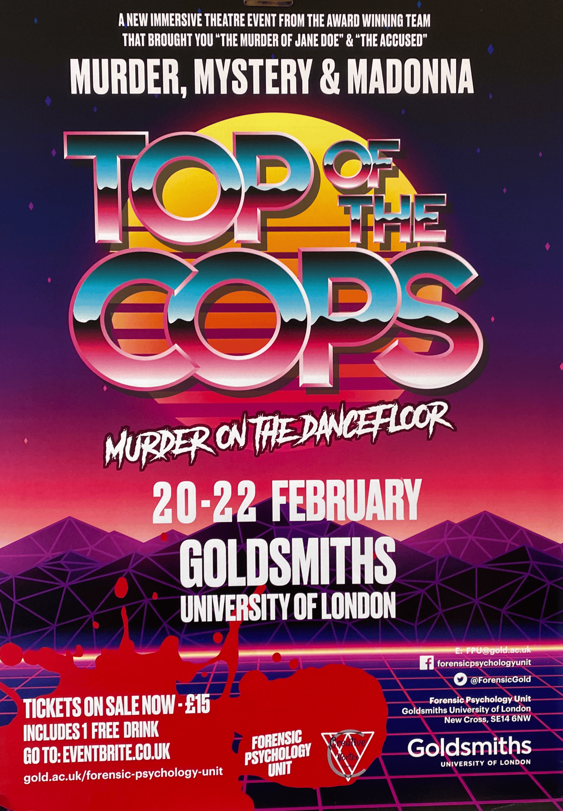{fig-alt="Top of the Cops poster" width="100%"}
:::
::::

Real psychology. Real evidence. Real audience participation. Hundreds of members of the public, in costume, solving crimes using forensic psychology.

---

## {.smaller}

:::: {.columns}
::: {.column width="50%"}
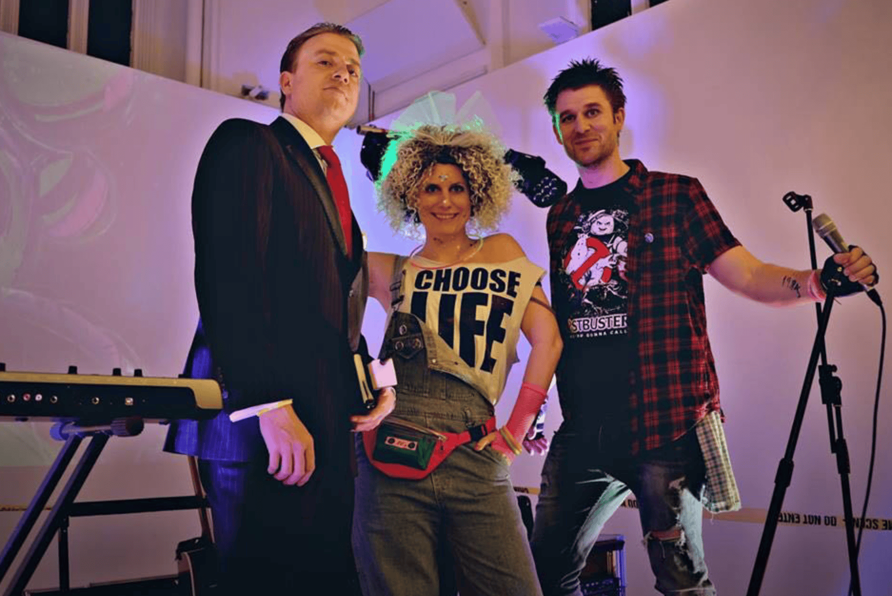{fig-alt="FPU 80s event" width="100%"}

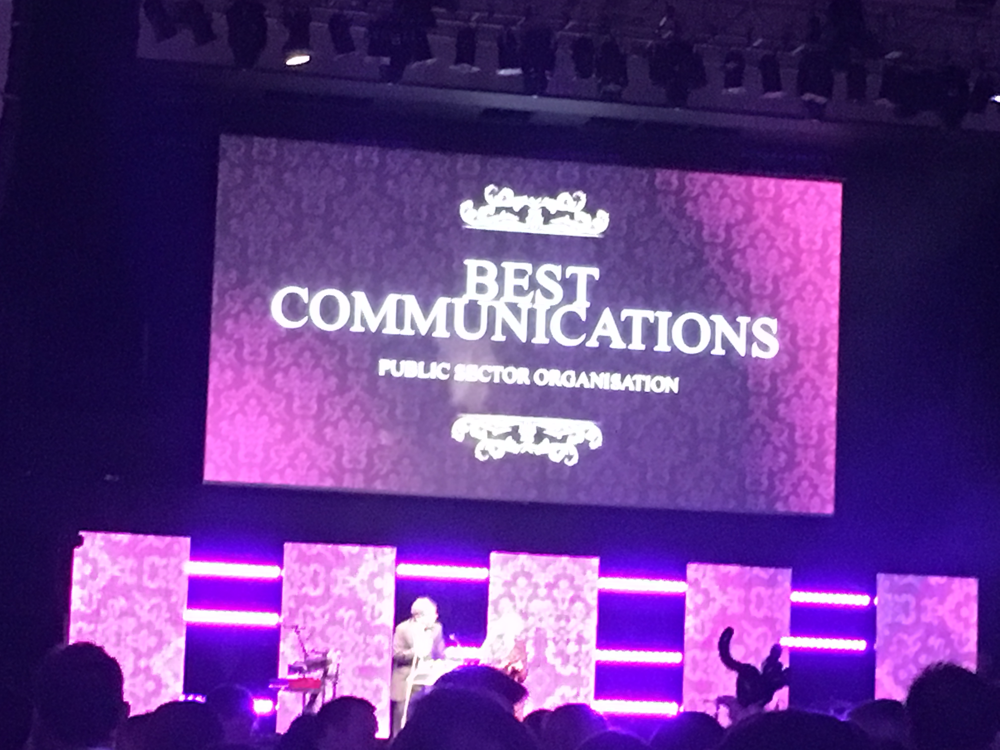{fig-alt="Corporate Comms Award" width="100%"}
:::
::: {.column width="50%"}
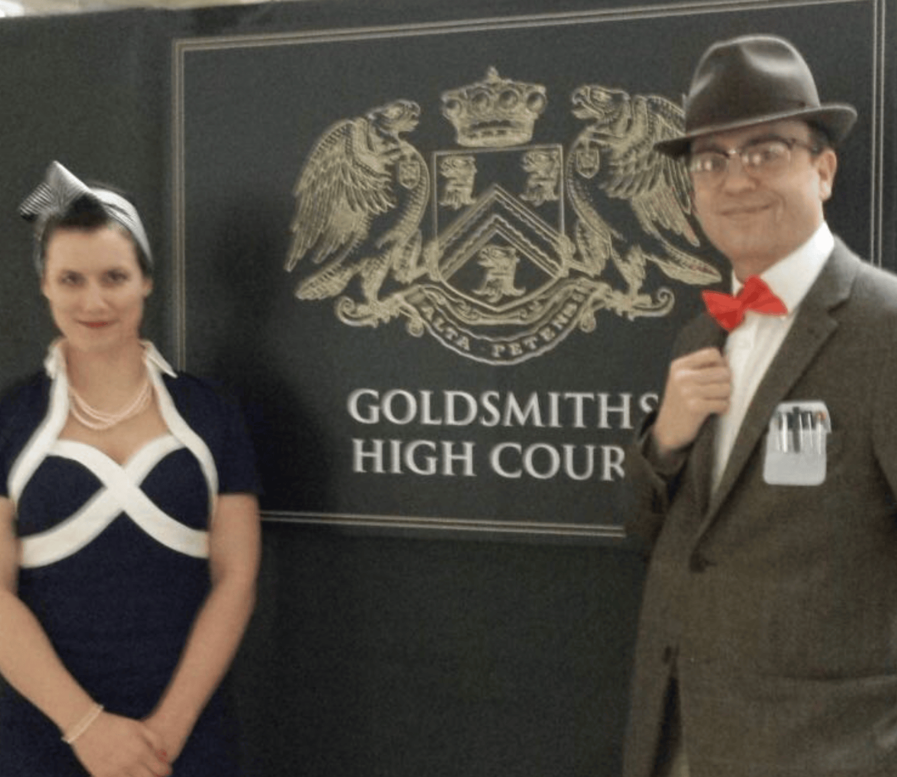{fig-alt="Goldsmiths High Court" width="100%"}

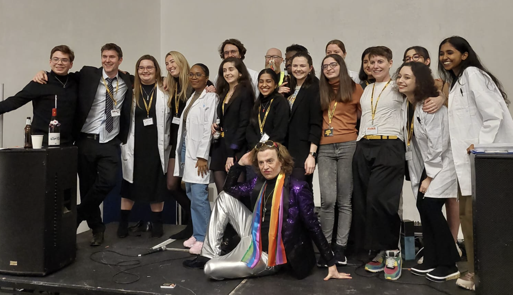{fig-alt="Cold Case cast" width="100%"}
:::
::::

These events were **student-led**. Staff just acted like idiots. The research was real. The communication was theatrical. The audience learned without realising they were being taught.

---

## And yes, it got weird {.center}

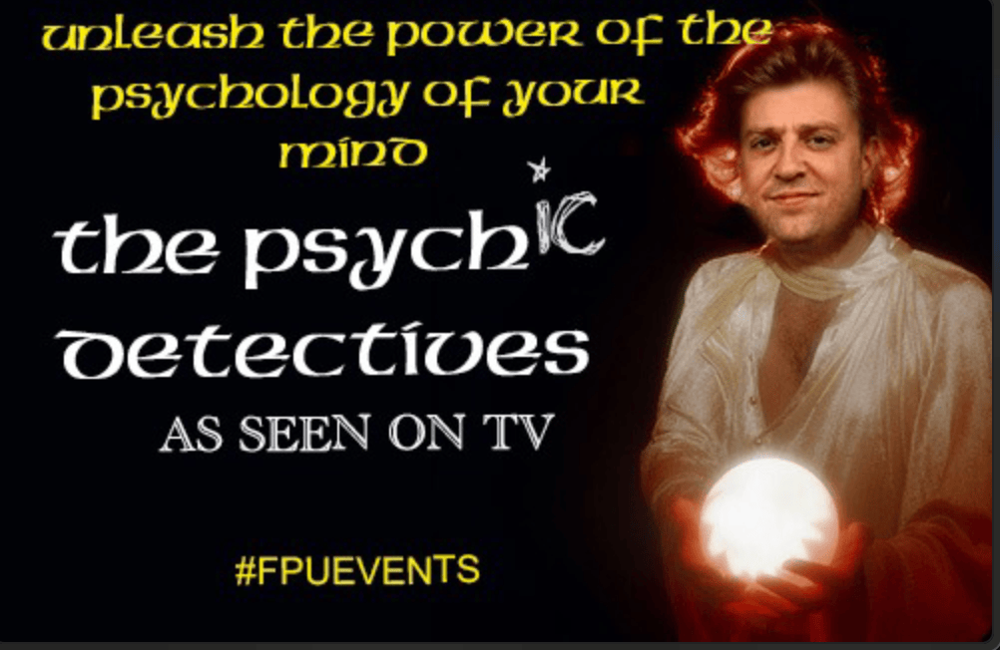{fig-alt="Psychic Detectives poster" fig-align="center" width="50%"}

We even ran an event debunking psychic detectives. Using psychology. As seen on TV.

The point: **there is no format that science communication cannot occupy.**

---

## In business: every single day {.smaller}

Here is the part nobody tells you in a psychology degree:

**Most of the working world runs on communication.**

| Role | What they actually do all day |
|------|------------------------------|
| Management consultant | Reads complex data, writes clear decks |
| UX researcher | Translates user behaviour into design recommendations |
| Policy adviser | Turns evidence into briefings ministers can act on |
| Marketing strategist | Makes complicated products feel simple |
| Clinical psychologist | Explains diagnoses and treatment plans to patients and families |
| Data analyst | Tells stories with numbers |
| Founder / entrepreneur | Pitches, pitches, pitches |

Every one of these is science communication with the serial numbers filed off.

---

## {background-color="#1a1a1a"}

::: {.r-fit-text style="color: white;"}
The skill is the same.<br>The stage changes.
:::

---

## Your trajectory at Goldsmiths

This module is not the destination. It is the first rung.

```{mermaid}
%%| fig-width: 10
flowchart LR
    A["<b>Year 1</b><br>Science Communication<br><i>Blog Post</i>"] ==> B["<b>Year 2</b><br>Science Fair<br><i>Poster & Presentation</i>"]
    B ==> C["<b>Year 3</b><br>Science Conference<br><i>Research Talk</i>"]
    C ==> D["<b>Beyond</b><br>Ownership<br><i>Your Voice, Your Platform</i>"]

    style A fill:#9B1B30,color:#fff,stroke:#fff,stroke-width:2px
    style B fill:#61589C,color:#fff,stroke:#fff,stroke-width:2px
    style C fill:#008080,color:#fff,stroke:#fff,stroke-width:2px
    style D fill:#1a1a1a,color:#fff,stroke:#fff,stroke-width:2px

    linkStyle 0 stroke:#9B1B30,stroke-width:4px
    linkStyle 1 stroke:#61589C,stroke-width:4px
    linkStyle 2 stroke:#008080,stroke-width:4px
```

---

## Year 1: Science Communication

**Where you are now.**

You take someone else's research and communicate it to a general audience.

This builds:

- **Reading comprehension** at speed
- **Audience awareness** (who am I writing for?)
- **Narrative structure** (beginning, middle, end)
- **Visual communication** (at least one original figure)
- **Writing under constraint** (800--1000 words is harder than 3000)

---

## Year 2: Science Fair

**Where you are going next.**

You present your *own* empirical work on a poster, face to face.

This adds:

- **Speaking to strangers** about your work
- **Defending your reasoning** under live questioning
- **Designing for the wall** — a poster is not a paper, it is a billboard
- **Real-time adaptation** — reading your audience and adjusting

The blog post taught you to write for a reader you cannot see. The poster teaches you to communicate with a person standing right in front of you.

---

## Year 3: Science Conference

**Where it comes together.**

You present a full research talk at a student conference.

This adds:

- **Slide design** as argumentation
- **Timing and pacing** — 15 minutes, no more
- **Handling questions** from peers and academics
- **Professional identity** — this is how academics actually share knowledge

By Year 3, you will have communicated science in writing, on a poster, and from a podium. That is a portfolio, not a coursework history.

---

## Beyond Goldsmiths

**Where the skill becomes yours.**

You may never write another blog post about psychology. That is fine. The skills transfer completely:

- A management consultant explains a restructuring plan to a board
- A therapist explains a diagnosis to a worried parent
- A data scientist explains a model's predictions to a CEO who does not know what a regression is
- A founder explains their product to an investor in 90 seconds

**These are all the same skill.** Comprehension, structure, audience, clarity.

---

## {background-color="#9B1B30"}

::: {.r-fit-text style="color: white;"}
You are not learning<br>to blog about psychology.
:::

---

## {background-color="#9B1B30"}

::: {.r-fit-text style="color: white;"}
You are learning<br>to make the complex clear.
:::

---

## {background-color="#9B1B30"}

::: {.r-fit-text style="color: white;"}
That is the skill<br>that changes everything.
:::

---

## What they all share

It is not fame. It is not charisma.

It is **the refusal to hide behind jargon**.

Feynman used a glass of ice water. Sagan used a photograph of Earth. Attenborough showed us a little monkey trying to make his way in the world. Loftus used Bugs Bunny. We turned the Great Hall into a courtroom with a dance floor.

They each decided that if the audience did not understand, the failure was theirs, not the audience's.

That is the mindset this module asks you to adopt.

Not: "Can I demonstrate that I understood the paper?"

But: "Can I make *you* understand it — and care?"

---

## Your coursework brief...

| | |
|---|---|
| **What** | 800--1000 word blog post (or 4--5 min video) |
| **About** | One target article, communicated to a non-expert audience |
| **Plus** | 480--600 word reflection using Bain's 5Rs |
| **Deadline** | Monday 11 May, 12 noon |
| **Submit via** | [Moodle](https://learn.gold.ac.uk/mod/coursework/view.php?id=1794744) |

---

## A blog in 2 minutes {background-iframe="https://www.loom.com/embed/db78e21169c64f3aaa4d18aa9d0ebb9a" background-interactive="true"}

---

## Everything you need is on the blog {.center}

::: {style="font-size: 1.1em;"}
**[littlemonkeylab.github.io/PS51009D_blog](https://littlemonkeylab.github.io/PS51009D_blog/)**
:::

| Resource | What it covers |
|----------|---------------|
| [How to Publish](https://littlemonkeylab.github.io/PS51009D_blog/contributing.html) | Step-by-step from RStudio Server to Moodle submission |
| [Formatting Guide](https://littlemonkeylab.github.io/PS51009D_blog/posts/formatting-guide/) | Copy-paste code for every Quarto feature |
| [Example Post](https://littlemonkeylab.github.io/PS51009D_blog/posts/example-post/) | A complete worked example of the required style |
| [Showcase](https://littlemonkeylab.github.io/PS51009D_blog/showcase/poster.html) | Dashboards, APA papers, interactive R, data art |

::: {style="text-align: center; margin-top: 1em; font-size: 0.9em; color: #666;"}
From no blog to new blog in minutes.
:::

---

## {.center background-color="#1a1a1a"}

::: {style="color: white; font-size: 1.4em;"}
**PS51009D Applications of Psychological Research**

Department of Psychology, Goldsmiths, University of London

Dr Gordon Wright — g.wright@gold.ac.uk

Dr Bence Palfi — b.palfi@gold.ac.uk
:::

::: {style="color: #ccc; font-size: 1.1em; margin-top: 1.5em;"}
Now go make something clear.
:::
